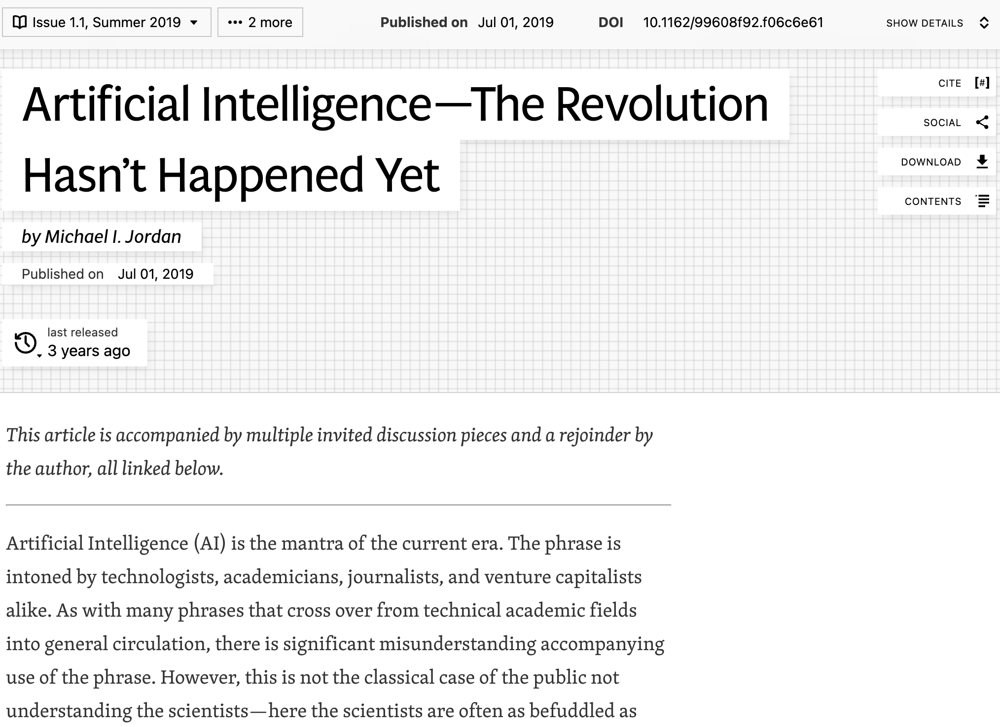
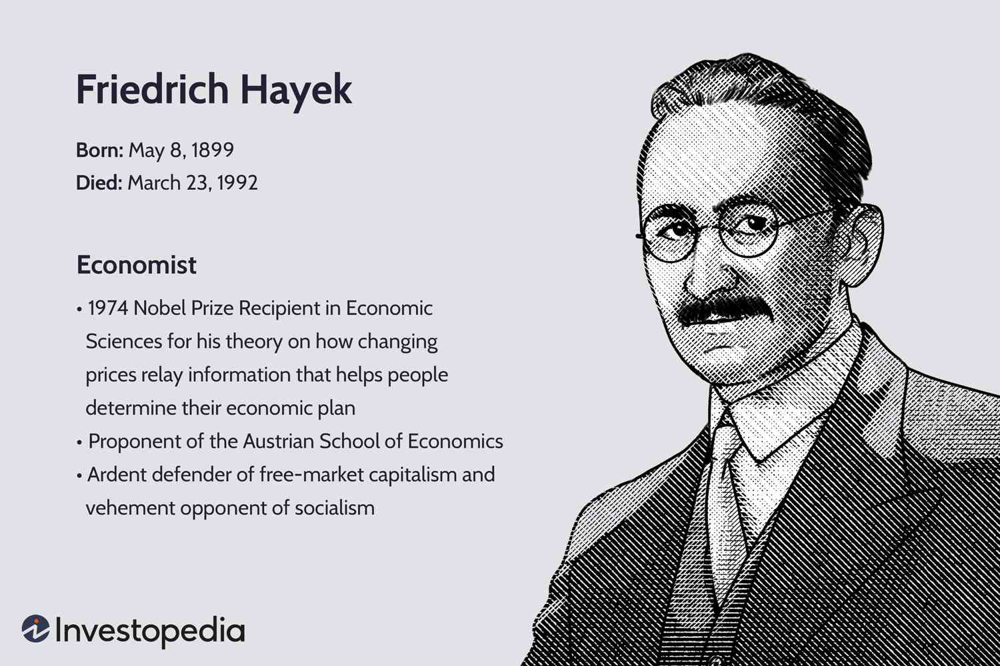
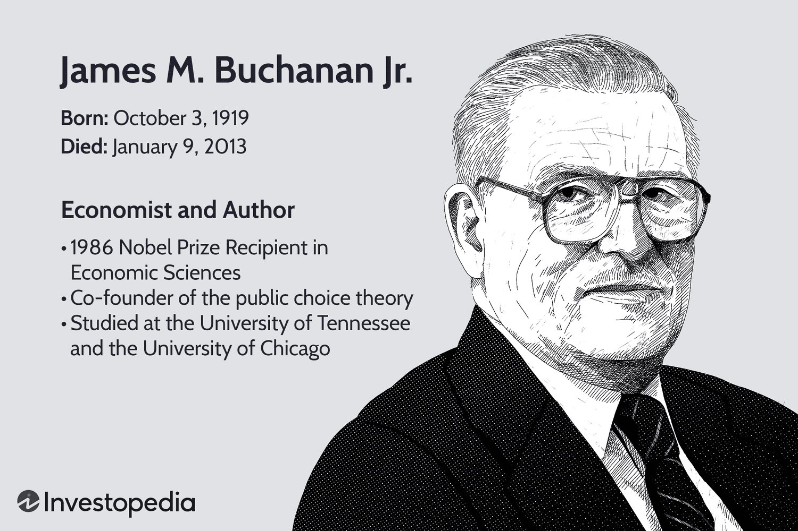
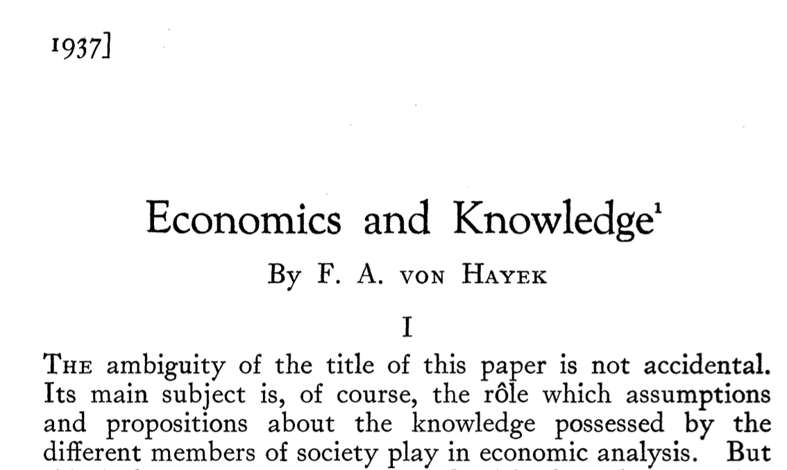
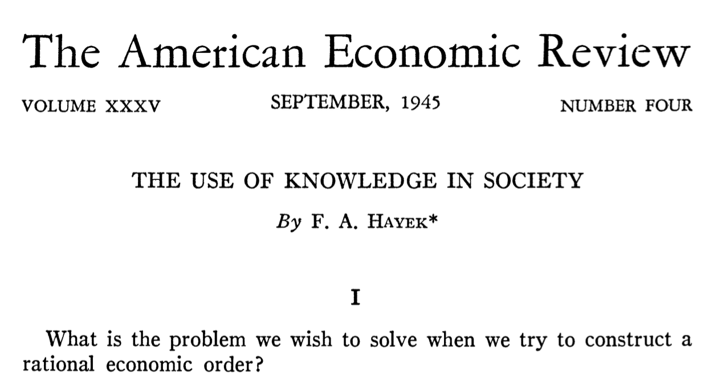
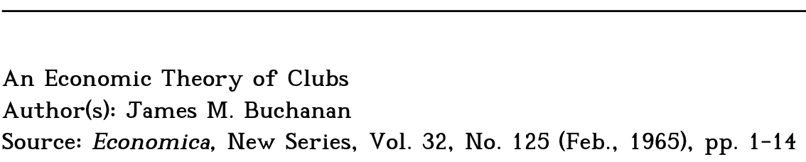
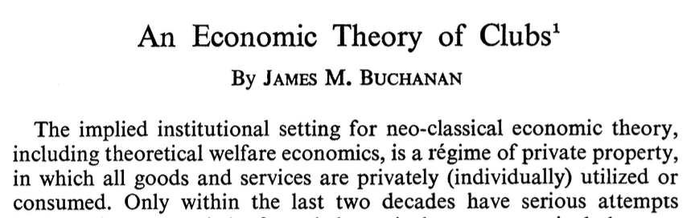
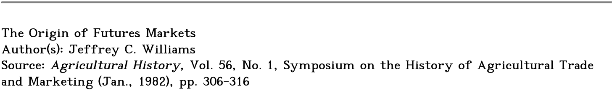
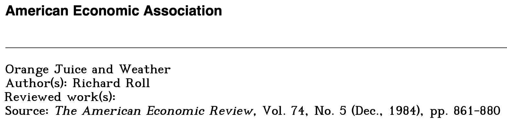
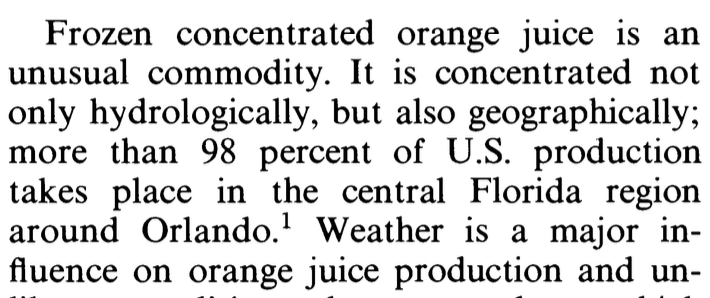

## Who Am I?

:::: {.columns .v-center}

::: {.column width="50%"}
{fig-align="center"}

::: {.incremental}
- [PhD Finance](https://eller.arizona.edu/departments-research/schools-departments/finance), [MS Finance](https://giesbusiness.illinois.edu/msf), [BA Economics](https://economics.byu.edu/).
- [Data Analytics + Information Systems](https://huntsman.usu.edu/dais/) at USU (FinTech).
- Academic Research Director of the [**Analytics Solutions Center**](https://huntsman.usu.edu/asc/).
:::

:::

::: {.column width="50%"}
{fig-align="center"}
:::

::::

## Michael I. Jordan: Data Science G.O.A.T? 

 

{fig-align="center"}

## Data Science: A Human-Centered Engineering Discipline

:::: {.columns .v-center}

::: {.column width="50%" .incremental}
- Let's pump the brakes on the AI hype machine!
- **NOT:** human imitative AI.
- Focus instead on:
  1. ***Intelligence Augmentation*** (IA).
  2. ***Intelligent Infrastructure*** (II).
- CS, Stats, & ***ECON***!
:::

::: {.column width="50%"}
{fig-align="center"}
:::

::::

## The G.O.A.T Quote 

 

::: {.center .r-fit-text}
> "We should embrace the fact that we are witnessing the creation of a new branch of engineering. The term engineering has connotations—in academia and beyond—of cold, affectless machinery, and of loss of control for humans, but an engineering discipline can be what we want it to be. In the current era, *we have a real opportunity to conceive of something historically new:* ***a human-centric engineering discipline.***"
:::

## Two Pillars of Catallactics {data-max-scale=1.8}

:::: {.columns .v-center}

::: {.column width="75%"}
{fig-align="center"}
:::

::: {.column width="75%"}
{fig-align="center"}
:::

::::

## Catallactics 

 

**Q: What kind of economics for a human-centered engineering discipline?**

 

::: {.incremental}
- Catallactics: economics as a humane science.
- *The science of exchange*, *to admit into the community*, *to turn an outsider into a friend*.
- The evolution of institutions as attempts to cope with knowledge/coordination problems.
- Think *exchange* paradigm rather than *allocation* paradigm!
:::

## Hayek on Catallactics 

::: {.r-fit-text}
> "The confusion which has been created by the ambiguity of the word economy is so serious that for our present purposes it seems necessary to confine its use strictly to the original meaning in which it describes a complex of deliberately co-ordinated actions serving a single scale of ends, and to adopt another term to describe the system of interrelated economics which constitute the market order."

> "The term 'catallactics' was derived from the Greek verb *katallattein* (or *katallassein*) which meant, significantly, not only ***'to exchange'*** but also ***'to admit into the community'*** and ***'to change from enemy into friend'***. From it the adjective 'catallatic' has been derived to serve in the place of 'economic' to describe the kind of phenomena with which the science of catallatics deals."
:::

## @BuchananSEJ1964 on Catallactics 

::: {.r-fit-text}
> "Should I have my say, I should propose that we cease, forthwith, to talk about 'economics' or 'political economy,' although the latter is the much superior term. Were it possible to wipe the slate clean, I should recommend that we take up a wholly different term such as ***'catallactics,'*** or ***'symbiotics.'***"

> "The elementary and basic approach that I suggest places 'the theory of markets' and not the 'theory of resource allocation' at center stage. My plea is really for the adoption of a sophisticated ***'catallactics'*** ..."
:::

## Hayekian Knowledge and Coordination Problems ... [see @HayekEconomica1937]

{fig-align="center"}

## ... And Their Institutional Solution [see @HayekAER1945]

{fig-align="center"}

## @BuchananECN1965

{fig-align="center"}

{fig-align="center" height="30%"}

## Lessons from Financial Markets [see @WilliamsAH1982]

{fig-align="center"}
{fig-align="center" height="20%"}

::: {.notes}
Williams' study of financial markets provides a compelling historical case study of the catallactic approach advocated by both Hayek and Buchanan. What Williams documents is not merely the efficiency of markets, but how specific institutional arrangements and contractual frameworks evolved to solve the Hayekian knowledge and coordination problems.

The paper demonstrates how, over time, market participants developed sophisticated institutional structures—including standardized contracts, clearing mechanisms, and price discovery systems—that effectively aggregated dispersed information. These weren't imposed from above but emerged through the voluntary exchange relationships that Hayek and Buchanan emphasized.

This historical example illustrates that technological solutions alone didn't drive market efficiency. Rather, it was the catallactic process—the admission of diverse participants into a community of exchange with well-defined rules—that enabled markets to function effectively despite no single participant having complete information.

The parallel to our data quality challenges is clear: we need similar institutional-contractual frameworks, not just better algorithms, to address the dispersed knowledge problem in data science.
:::

## @RollAER1984 on Orange Juice and Weather {.smaller}

::: {.figure fig-align="center"}

:::

::: {.figure width="500px" height="150px" fig-align="center"}

:::

## A Challenge for Entrepreneurs in Programmatic Sampling

 

::: {.incremental}
- What are the knowledge problems?
- What are the coordination problems?
- <a href="https://jddeitch.com/the-enshittification-of-programmatic-sampling-by-jd-deitch/" style="color: #0000FF"> Enshittification?</a> Yes! And **NO!!!**
- A ***humane*** data science requires proper ***exchange*** relationships.
- I don't believe that market failure or tragedy of the commons is the proper economic metaphor! 
- What we have is an incomplete set of contracts in a properly structured labor market.
- What are the missing institutions? How can Jordan's IA/II help create them?
:::

## Implications of Reframing

 

:::: {.columns .v-center}

::: {.column width="50%" .incremental}
- **Under the Market-Failure Paradigm**
  - Focus on preserving the "resource pool" of participants.
  - Treat the problem as one of overexploitation.
  - Seek regulatory or voluntary restrictions on access/usage.
  - Participant burnout as depletion of a finite resource rather than as rational economic disengagement.
:::

::: {.column width="50%" .incremental}
- **Under the Exchange Paradigm**
  - Focus on developing fair compensation and working conditions.
  - Treat respondents as service providers rather than resources.
  - Build institutional structures that formalize the relationship.
  - Establish professional standards and goverance procedures for quality monitoring.:
:::

::::

##

 

::: {.center .r-fit-text}
Thank You!
:::

## References 
